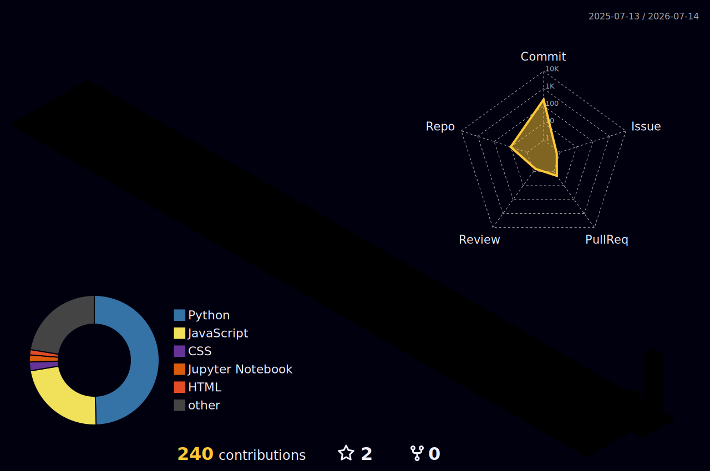

<div align="center">
  <a href="https://www.linkedin.com/in/nitish-pattar"></a>
  <a href="https://nitish-portfolio-amber.vercel.app"></a>
  <a href="https://leetcode.com/iamnitishpattar"></a>
</div>

<div align="center">
  
</div>

<br>

<div align="center">
  
</div>


---

### 👨‍💻 About Me

<table width="100%" border="0" cellspacing="0" cellpadding="0">
  <tr>
    <td width="65%" valign="top" style="border: none;">
      <ul>
        <li>🎓 Pursuing <b>Master of Computer Applications (MCA)</b></li>
        <li>🔭 Currently building <a href="https://github.com/iamnitishpattar/HelixVault"><b>HelixVault</b></a> — DNA-Based Data Storage</li>
        <li>🌱 Currently learning <b>Kubernetes, LLM Fine-tuning & RAG</b></li>
        <li>👯 Open to collaborate on <b>AI, ML & Full-Stack projects</b></li>
        <li>💬 Ask me about <b>Python, React, FastAPI, Machine Learning</b></li>
        <li>📫 Reach me at <a href="mailto:nitishpattar7@gmail.com"><b>nitishpattar7@gmail.com</b></a></li>
        <li>⚡ Fun fact: I encoded a file into DNA sequences and got it back perfectly — using Reed-Solomon Error Correction!</li>
      </ul>
    </td>
    <td width="35%" align="center" valign="top" style="border: none;">
      
    </td>
  </tr>
</table>

<br clear="right"/>

<div align="center">
  
</div>

<!-- Trophies -->
### 🏆 GitHub Trophies

<div align="center">
  
</div>

---

### 🛠️ Tech Stack & Tools

<div align="center">
  
</div>

---

### 🚀 Featured Projects

<div align="center">
  <table>
    <tr>
      <td width="50%">
        <a href="https://github.com/iamnitishpattar/HelixVault">
          
        </a>
        <br>
        <p><b>🧬 DNA-Based Data Storage System</b><br>A cloud-deployed full-stack app (Next.js + FastAPI) that encodes files into DNA sequences, simulates biological mutations, and recovers data using Reed-Solomon Error Correction.</p>
      </td>
      <td width="50%">
        <a href="https://github.com/iamnitishpattar/Financial-Market-News-Sentiment-Analysis">
          
        </a>
        <br>
        <p><b>📈 Financial News Sentiment Analysis</b><br>An end-to-end ML project performing Sentiment Analysis on financial market news headlines using NLP and a Random Forest Classifier to predict stock market movements.</p>
      </td>
    </tr>
    <tr>
      <td width="50%">
        <a href="https://github.com/iamnitishpattar/-real-estate-price-prediction-">
          
        </a>
        <br>
        <p><b>🏠 Market Predictor & Analytics</b><br>An analytical web app with interactive charts and a prediction form to forecast real estate prices using historical market data and ML models.</p>
      </td>
      <td width="50%">
        <a href="https://github.com/iamnitishpattar/SMS-spam-classifier">
          
        </a>
        <br>
        <p><b>🤖 AI NLP Application</b><br>A Flask web app with Glassmorphism UI using TF-IDF and Naive Bayes to classify SMS messages as Spam or Ham with 97.8% accuracy.</p>
      </td>
    </tr>
    <tr>
      <td width="50%">
        <a href="https://github.com/iamnitishpattar/aws-cloud-ops-dashboard">
          
        </a>
        <br>
        <p><b>☁️ AWS Cloud Ops Dashboard</b><br>A full-stack cloud operations dashboard to provision, manage, and monitor AWS EC2 instances with real-time metrics and an intuitive web interface.</p>
      </td>
      <td width="50%">
      </td>
    </tr>
  </table>
</div>

<div align="center">
  
</div>

### 📊 GitHub Analytics

<div align="center">
  <a href="https://github.com/iamnitishpattar">
    
  </a>
  <a href="https://github.com/iamnitishpattar">
    
  </a>
</div>

<br>

<div align="center">
  
</div>

<br>

<div align="center">
  
</div>


---

### ⏱️ WakaTime Coding Stats

<!--START_SECTION:waka-->

```txt
From: 12 July 2026 - To: 19 July 2026

Total Time: 10 hrs 36 mins

JSON         3 hrs 51 mins         ⣿⣿⣿⣿⣿⣿⣿⣄⣀⣀⣀⣀⣀⣀⣀⣀⣀⣀⣀⣀⣀⣀⣀⣀⣀   28.50 %
Markdown     3 hrs 7 mins          ⣿⣿⣿⣿⣿⣾⣀⣀⣀⣀⣀⣀⣀⣀⣀⣀⣀⣀⣀⣀⣀⣀⣀⣀⣀   23.10 %
Other        2 hrs 57 mins         ⣿⣿⣿⣿⣿⣦⣀⣀⣀⣀⣀⣀⣀⣀⣀⣀⣀⣀⣀⣀⣀⣀⣀⣀⣀   21.78 %
TypeScript   2 hrs 30 mins         ⣿⣿⣿⣿⣶⣀⣀⣀⣀⣀⣀⣀⣀⣀⣀⣀⣀⣀⣀⣀⣀⣀⣀⣀⣀   18.52 %
Python       35 mins               ⣿⣄⣀⣀⣀⣀⣀⣀⣀⣀⣀⣀⣀⣀⣀⣀⣀⣀⣀⣀⣀⣀⣀⣀⣀   04.39 %
```

<!--END_SECTION:waka-->

> 💡 *Stats update automatically once [WakaTime](https://wakatime.com) is set up in VSCode*

---

<!-- Activity Graph -->
### 📈 Contribution Activity

<div align="center">
  
</div>

---

### 📊 GitHub Stats Radar

<div align="center">
  
  
</div>

<div align="center">
  
  
</div>

---

### 🐍 GitHub Contribution Snake

<div align="center">
  <picture>
    <source media="(prefers-color-scheme: dark)" srcset="https://raw.githubusercontent.com/iamnitishpattar/iamnitishpattar/output/github-contribution-grid-snake-dark.svg">
    <source media="(prefers-color-scheme: light)" srcset="https://raw.githubusercontent.com/iamnitishpattar/iamnitishpattar/output/github-contribution-grid-snake.svg">
    
  </picture>
</div>

---

### 🌐 GitHub Skyline

<div align="center">
  <a href="https://skyline.github.com/iamnitishpattar/2025">
    
  </a>
  <a href="https://skyline.github.com/iamnitishpattar/2026">
    
  </a>
</div>

---

### 🗓️ 3D Contribution Calendar

<div align="center">
  
</div>

---

<!-- Dev Quote -->
### 💬 Dev Quote of the Day

<div align="center">
  
</div>

---

### 📡 Latest GitHub Activity

<!--START_SECTION:activity-->
1. 💪 Opened PR [#2996](https://github.com/npmx-dev/npmx.dev/pull/2996) in [npmx-dev/npmx.dev](https://github.com/npmx-dev/npmx.dev)
2. 💪 Opened PR [#2242](https://github.com/activist-org/activist/pull/2242) in [activist-org/activist](https://github.com/activist-org/activist)
<!--END_SECTION:activity-->

<div align="center">
  <p></p>
</div>

<div align="center">
  
</div>

### 🤝 Connect & Support

<div align="center">

[](https://nitish-portfolio-amber.vercel.app)
[](https://www.linkedin.com/in/nitish-pattar)
[](mailto:nitishpattar7@gmail.com)
[](https://github.com/iamnitishpattar)
[](https://topmate.io/iamnitishpattar)

</div>

<br>

<div align="center">
  
</div>

<br>

<div align="center">
  <i>⭐ Star my repos if you find them useful! Every star motivates me to build more. ⭐</i>
</div>


