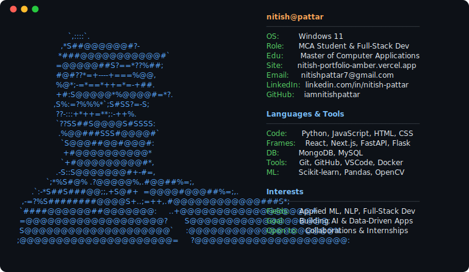
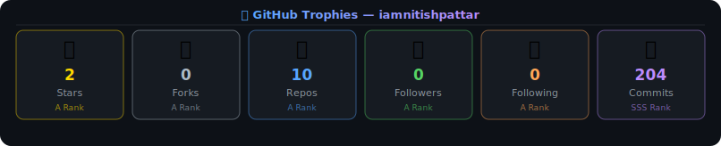

  

 

  

---

### 👨‍💻 About Me

- 🎓 Pursuing **Master of Computer Applications (MCA)**
- 🔭 Currently building **[HelixVault](https://github.com/iamnitishpattar/HelixVault)** — DNA-Based Data Storage
- 🌱 Currently learning **Kubernetes, LLM Fine-tuning & RAG**
- 👯 Open to collaborate on **AI, ML & Full-Stack projects**
- 💬 Ask me about **Python, React, FastAPI, Machine Learning**
- 📫 Reach me at **nitishpattar7@gmail.com**
- ⚡ Fun fact: I encoded a file into DNA sequences and got it back perfectly — using Reed-Solomon Error Correction!

 

---

<!-- Trophies -->
### 🏆 GitHub Trophies

  

---

### 🛠️ Tech Stack & Tools

---

### 🚀 Featured Projects

  <table>
    <tr>
      <td width="50%">
        
         
        
<b>🧬 DNA-Based Data Storage System</b> A cloud-deployed full-stack app (Next.js + FastAPI) that encodes files into DNA sequences, simulates biological mutations, and recovers data using Reed-Solomon Error Correction.

      </td>
      <td width="50%">
        
         
        
<b>📈 Financial News Sentiment Analysis</b> An end-to-end ML project performing Sentiment Analysis on financial market news headlines using NLP and a Random Forest Classifier to predict stock market movements.

      </td>
    </tr>
    <tr>
      <td width="50%">
        
         
        
<b>🏠 Market Predictor & Analytics</b> An analytical web app with interactive charts and a prediction form to forecast real estate prices using historical market data and ML models.

      </td>
      <td width="50%">
        
         
        
<b>🤖 AI NLP Application</b> A Flask web app with Glassmorphism UI using TF-IDF and Naive Bayes to classify SMS messages as Spam or Ham with 97.8% accuracy.

      </td>
    </tr>
    <tr>
      <td width="50%">
        
         
        
<b>☁️ AWS Cloud Ops Dashboard</b> A full-stack cloud operations dashboard to provision, manage, and monitor AWS EC2 instances with real-time metrics and an intuitive web interface.

      </td>
      <td width="50%">
      </td>
    </tr>
  </table>

---

### 📊 GitHub Analytics

  
  

 

  

---

### ⏱️ WakaTime Coding Stats

  

> 💡 *Stats update automatically once [WakaTime](https://wakatime.com) is set up in VSCode*

---

<!-- Activity Graph -->
### 📈 Contribution Activity

  

---

### 🐍 GitHub Contribution Snake

  <picture>
    <source media="(prefers-color-scheme: dark)" srcset="https://raw.githubusercontent.com/iamnitishpattar/iamnitishpattar/output/github-contribution-grid-snake-dark.svg">
    <source media="(prefers-color-scheme: light)" srcset="https://raw.githubusercontent.com/iamnitishpattar/iamnitishpattar/output/github-contribution-grid-snake.svg">
    
  </picture>

---

<!-- Dev Quote -->
### 💬 Dev Quote of the Day

  

---

### 😄 Random Dev Joke

  

---

### 🤝 Connect & Support

 

  

 

  <i>⭐ Star my repos if you find them useful! Every star motivates me to build more. ⭐</i>

